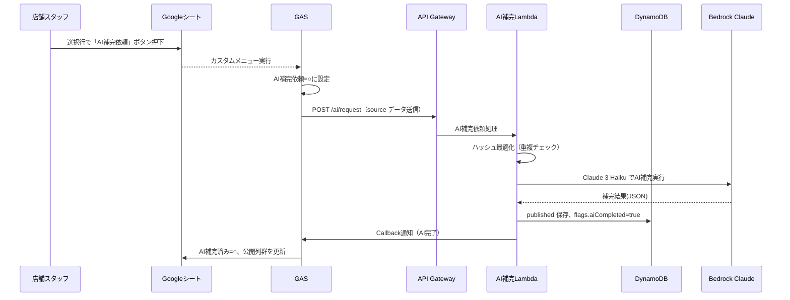
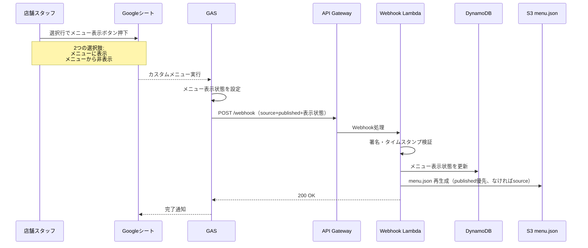
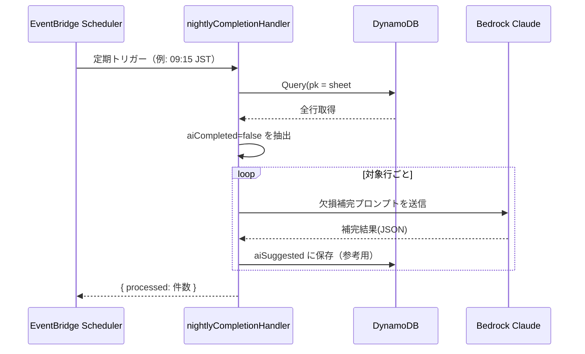

# Bar Ease Hongo メニューアプリ 仕様書（AI補完・公開情報承認フロー）

本仕様は、**スプレッドシート + AI補完 + ボタン方式の公開承認**を備えたメニュー配信アプリの最新設計です。

---

## 1. 関係者とロール

- **Viewer（お客さま）**: 公開済みの `menu.json` を閲覧するのみ。認証不要。
- **Editor（店舗スタッフ）**: Google シートを編集し、AI補完依頼・公開承認を実施。
- **Admin（運用者）**: GAS 設定・AWS インフラ運用・Secrets 管理を担当。

操作権限:
- AI補完依頼・公開承認: Editor/Admin のみ
- インフラ管理: Admin のみ

---

## 2. 目的 / ゴール

* 店舗管理は **Google スプレッドシート**のみ（SSOT運用）。
* AI補完はボタン方式で依頼、結果を確認後、公開もボタンで承認。
* 元情報（source）と優先公開情報（published）を分離し、published 優先でメニュー表示。
* UIはスマホ前提（黒＋金＋白の高級感デザイン）、PC/タブレットでも自然に表示。

---

## 3. データ構造

### 3.1 スプレッドシート列構成

| 列名 | 位置付け | 入力 | 備考 |
|------|----------|------|------|
| 既存列（国、製造会社、商品名...） | 元情報（source） | 可 | 手入力データ |
| **公開商品名** | 優先公開情報 | 可 | published.name |
| **公開メーカー** | 優先公開情報 | 可 | published.maker |
| **公開カテゴリ** | 優先公開情報 | 可 | published.category |
| **公開タグ** | 優先公開情報 | 可 | カンマ区切り |
| **公開説明文** | 優先公開情報 | 可 | published.description |
| **公開度数** | 優先公開情報 | 可 | published.alcoholVolume |
| **公開画像URL** | 優先公開情報 | 可 | published.imageUrl（ハイパーリンク） |
| **AI補完状態** | 状態 | 不可 | 依頼済み/成功/失敗 |
| **メニュー表示状態** | 表示制御 | 不可 | メニューに表示/非表示 |
| **ID** | 識別 | 自動 | UUID |
| **更新日時** | メタ | 自動 | ISO8601 |

### 3.2 DynamoDB スキーマ

```typescript
{
  pk: "sheet#menu",
  sk: "item#00000001",
  id: "00000001",
  source: {
    name, maker, category, tags, description, alcoholVolume, imageUrl,
    country, manufacturer, distributor, distillery, type, caskNumber,
    caskType, maturationPlace, maturationPeriod, availableBottles,
    price30ml, price15ml, price10ml, notes
  },
  published: {
    name?, maker?, category?, tags?, description?, alcoholVolume?,
    imageUrl?, country?, type?, caskType?, maturationPeriod?
  },
  aiSuggested: { /* AI候補（参考用） */ },
  flags: {
    aiRequested: boolean,
    aiCompleted: boolean,
    aiFailed: boolean,
    publishApproved: boolean,  // true=メニューに表示, false=非表示
    sourceHash: string,
    publishedHash: string
  },
  createdAt, syncedAt, updatedAt
}
```

---

## 4. 全体フロー（人・システム）

### 4.1 AI補完フロー



### 4.2 公開承認フロー



### 4.3 夜間バッチ（バックアップ用）



---

## 5. AI補完フロー詳細

1. スタッフが選択行で「AI補完依頼」ボタン押下
2. GAS: 「AI補完依頼=○」に設定 → `POST /ai/request` 呼び出し（source データ送信）
3. Lambda: 
   - ハッシュ最適化（前回と同じならスキップ）
   - Claude 3 Haiku でAI補完実行
   - DynamoDB に published 保存、flags.aiCompleted=true に更新
   - GAS Callback Webhook 送信（AI完了通知）
4. GAS Callback 受信: 「AI補完状態=成功」＋公開列群を更新
5. スタッフが公開列を確認・必要なら修正
6. 修正時: onEdit で「メニュー表示状態」を自動クリア
7. 選択行でメニュー表示ボタン押下（2つの選択肢）:
   - 「メニューに表示」: メニュー表示状態=メニューに表示（優先公開情報優先、なければ元情報を表示）
   - 「メニューから非表示」: メニュー表示状態=非表示
8. GAS: 対応する列を設定 → `POST /webhook` 呼び出し（source + published + メニュー表示状態 送信）
9. Lambda: DynamoDB 更新 → menu.json 再生成（各フィールドごとにpublished優先、なければsource）
10. 公開完了

### AI補完プロンプト（Claude 3 Haiku）

```
以下の「お酒（酒類）アイテム」の情報について、公式情報（メーカー公式サイト、正規輸入元、公式資料）を最優先に、欠損値または明らかに間違っている情報のみを補完・修正してください。

補完対象:
- 空欄・未入力のフィールド
- 明らかに間違っている情報（例：存在しないメーカー名、不整合な度数、誤った国名など）
- 整合性のない情報（例：商品名とメーカーが一致しない、不可能な熟成年数など）

既存値が妥当で正確な場合は変更せず、欠損または誤りがあるフィールドのみを返してください。

JSONスキーマ（補完が必要なフィールドのみ返す）:
{
  "name": "商品名",
  "maker": "メーカー名（正規表記）",
  "category": "カテゴリ（例：ウイスキー／ラム／ジン／ビール 等）",
  "description": "50〜80文字程度の説明（宣伝文句ではなく中立・簡潔）",
  "tags": ["3〜5個の味わい・特徴タグ（例：smoky, fruity）"],
  "country": "生産国（必ず和名で統一。例：スコットランド、アイルランド、アメリカ、日本）",
  "type": "タイプ（例：シングルモルト、ブレンデッド、IPA）",
  "maturationPeriod": "熟成年数",
  "caskType": "樽種",
  "alcoholVolume": "度数 (数値, %)",
  "imageUrl": "候補画像URL（公式画像優先）"
}

前提・ポリシー:
- 公式情報を最優先
- 既存値が正確な場合は変更しない
- 返すJSON以外のテキストは出力しない

既存の値:
{source データ}
```

---

## 6. API 仕様

### POST /ai/request
- 入力: `{ itemId, source: {...} }`
- 処理: AI補完実行 → published 保存 → Callback通知
- 応答: `{ ok: true, itemId, published }`

### GET /ai/result
- 入力: `?ids=00000001,00000002`
- 処理: 指定IDの flags/published を返却
- 応答: `{ items: [{ id, flags, published }], total }`

### POST /webhook
- 入力: `{ itemId, source, published, publishStatus }`
- 処理: Dynamo更新（メニュー表示状態） → menu.json 再生成（published優先、なければsource）
- 応答: `{ ok: true, itemId }`

---

## 7. カスタムメニュー（GAS）

| ボタン | 対象 | 動作 |
|--------|------|------|
| AI補完を実行 | 選択行 | AI補完状態=依頼済み → POST /ai/request |
| メニューに表示 | 選択行 | メニュー表示状態=メニューに表示 → POST /webhook |
| メニューから非表示 | 選択行 | メニュー表示状態=非表示 → POST /webhook |
| 最新情報を取得（1行のみ） | 選択行 | GET /ai/result → シート更新 |
| 最新情報を取得（全体） | 全体 | GET /ai/result → シート更新 |
| IDを生成 | 選択行 | UUID生成・設定 |
| データ修復 | 全体 | 未実装（デバッグ用） |
| スケジュール設定 | - | 全体更新スケジュール管理 |

---

## 8. フロントエンド設計（スマホ優先）

### トーン＆マナー
- 背景：#0B0B0D（黒）
- テキスト：#F5F5F5（白）／#D9D9D9（グレー）
- アクセント：#C9A227（金）
- フォント：セリフ系タイトル + サンセリフ本文

### レイアウト
- `/menu`: メーカー/カテゴリフィルタ + カードリスト
- `/menu/[id]`: 詳細表示
- `/recommend`: AI レコメンド

---

## 9. インフラ構成

- **S3**: menu.json, embeddings.json, 画像
- **API Gateway + Lambda**: `/ai/request`, `/ai/result`, `/webhook`, `/recommend`
- **DynamoDB**: sheet#menu パーティション
- **Bedrock**: Claude 3 Haiku（補完） + Titan Embeddings（類似度）
- **GAS**: ボタン操作 + Callback 受信
- **SST v3**: IaC + ステージ管理

---

## 10. 運用ポリシー

- GAS に AWS 長期クレデンシャルを置かない（署名認証のみ）
- 画像は必ず Staging → Public のコピーで公開
- Webhook が失敗した場合は Apps Script のログを確認し、ボタン再実行でリトライ可能
- AI補完は必要最小限（ハッシュで重複防止）
- メニュー表示は各フィールドごとに判定（published優先、なければsource）
- 優先公開列編集時は「メニュー表示状態」を自動クリア
- メニュー表示はボタン承認のみ（メニュー表示状態=メニューに表示、flags.publishApproved=true）
- メニュー非表示は「メニュー表示状態=非表示」で制御

---

## 11. 受け入れ基準

- AI補完依頼 → 完了通知 → シート更新が30秒以内
- メニュー表示承認 → menu.json 反映が5分以内
- スマホでCLS/INP良好（LCP<2.5s）
- 誤操作防止（列変更でAPI呼び出しなし、ボタンのみ）
- 優先公開情報優先、なければ元情報というフォールバックロジックが正しく動作

---

## 12. レコメンド（Titan Embeddings）

### 処理フロー
1. 入力: `{ text, filters, limit }`
2. Titan Embeddings でベクトル化
3. embeddings.json とコサイン類似度計算
4. フィルタ適用 → Top-K 返却

### 応答
   ```json
   {
     "items": [
       {
      "id": "00000123",
         "score": 0.94,
         "name": "アードベッグ 10年",
         "maker": "Ardbeg",
      "imageUrl": "https://...",
      "reason": "スモーキーでフルーティー"
       }
     ]
   }
   ```

---

## AI モデル利用

- Claude 3 Haiku: `anthropic.claude-3-haiku-20240307-v1:0`
- Titan Embeddings v2: `amazon.titan-embed-text-v2:0`
- 最小権限で ARN 指定（SST）

