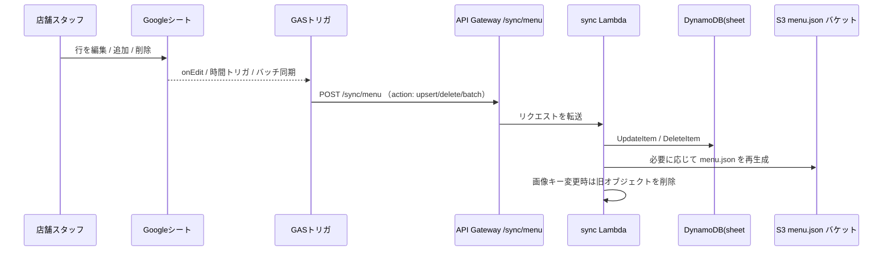
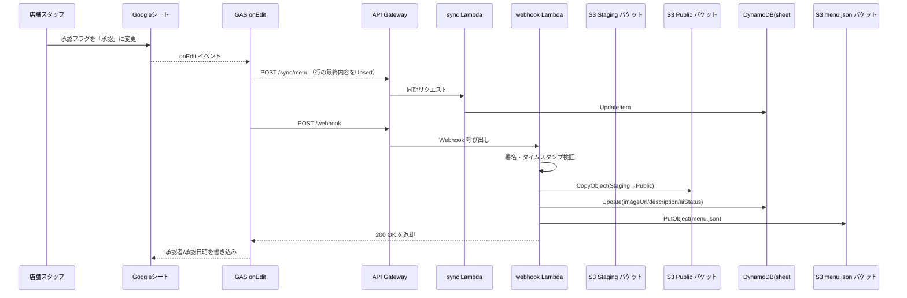
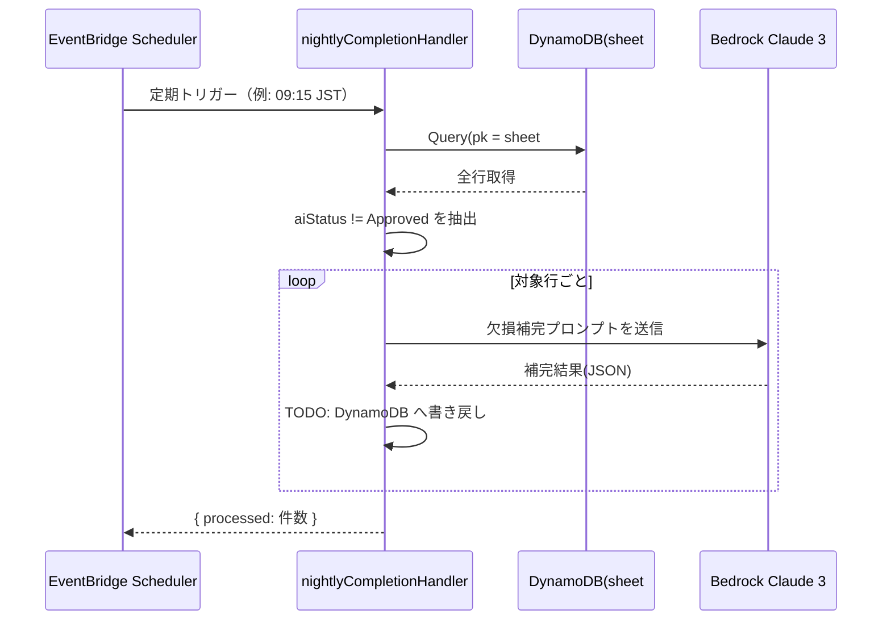

# 承認フロー設計（2025-10 現在実装）

現在の実装に合わせた承認フロー、夜間バッチとの連携、および公開状態の制御をまとめています。システム変更時は本書も必ず更新してください。

---

## 1. 関係者とロール

- **Viewer（お客さま）**: 公開済みの `menu.json` を閲覧するのみ。認証不要。
- **Editor（店舗スタッフ）**: Google シートを編集し、承認フラグを変更可能。
- **Admin（運用者）**: GAS 設定・AWS インフラ運用・Secrets 管理を担当。

承認操作は Editor/Admin のみが実施すると想定しています。

---

## 2. 全体フロー（人・システム）

### 2.1 シート編集・同期

- onEdit で即時同期、時間ベースのトリガで一括同期＆削除検知を実施。
- GAS は `SYNC_URL` と `WEBHOOK_SECRET` を用いて署名付きで API を呼び出します。

### 2.2 承認時の処理

### 補足: nightlyCompletionHandler の流れ

- 夜間バッチは欠損補完候補を生成するのみで、現状は DynamoDB 更新が未実装（TODO）。
- 承認 Lambda で `aiStatus` を `Approved` に変えるため、夜間バッチは `NeedsReview` など承認待ちレコードを対象に補完する想定です。

---

## 3. 公開状態の制御

| フィールド | 管理主体 | 更新タイミング | 備考 |
| ---------- | -------- | -------------- | ---- |
| `status` | スプレッドシート（人） | シート編集時 | `Published` のみが公開候補。
| `approveFlag` | スプレッドシート（人） | `承認` 選択時 | GAS が Webhook を起動。
| `aiStatus` | Lambda / 夜間バッチ | 夜間補完 or Webhook 完了時 | 夜間補完は `NeedsReview`、Webhook で最終 `Approved` に更新。
| `imageUrl` | Lambda | Webhook で公開バケットコピー後 | `publicKey` を元に S3 URL を設定。
| `description` | Lambda | Webhook で AI 候補を採用 | `aiSuggestedDescription` があれば昇格。
| `menu.json` | Lambda | Webhook or 手動トリガー | `status=Published` & `approveFlag=Approved` のみ反映。
| `createdAt` | Sync Lambda | 初回 Upsert 時 | 生成時刻（ISO8601）。
| `syncedAt` | Sync Lambda | Upsert / Delete 処理毎 | 同期完了時刻。

公開フローのポイント:

1. `status=Published` かつ `approveFlag=Approved` の行のみが `menu.json` に含まれる。
2. `imageUrl` は承認後に Lambda が `public` バケットの URL へ更新。
3. `aiStatus` や説明文は夜間補完→人の承認→Webhook 書き戻しで確定。
4. `menu.json` は S3 に `max-age=60, s-maxage=300` で配置（CloudFront 無効化は未実装）。

---

## 4. 処理ステップ詳細

1. **Spreadsheet 操作**
   - 承認フラグや商品名の変更、行の追加/削除など、すべての編集が対象。
   - 商品名を変更すると `承認フラグ` を `-`、`AIステータス` を `NeedsReview` に戻し、画像キーをリセット。

2. **GAS → Sync API（`/sync/menu`）**
   - onEdit で編集行を Upsert。行削除は時間トリガで差分検知し `action: delete` を送信。
   - Script Properties: `SYNC_URL` と `WEBHOOK_SECRET` を利用。
   - payload 例: `{ action: 'upsert', item: { id, name, ... } }` / `{ action: 'delete', itemIds: [...] }`

3. **GAS → Webhook（承認時のみ）**
   - `承認フラグ` が `承認` になったタイミングで `{ itemId, stagingKey, publicKey }` を送信。
   - 同イベント内で Sync API も呼び出し、承認者/承認日時の差分も DynamoDB に反映。
   - GAS 側で `AIステータス` を `Approved` に更新してから同期するため、DynamoDB 側も確定状態が保持される。

4. **Webhook Lambda (`services/lambda/menu/src/index.ts`)**
   - HMAC 署名＋タイムスタンプ検証。
   - 画像コピー（Staging→Public）、DynamoDB 更新（`imageUrl` 再設定、`aiStatus`=Approved 等）、`menu.json` 再生成。

5. **夜間バッチ (`nightlyCompletionHandler`)**
   - `aiStatus !== 'Approved'` の行に対して Claude 補完（書き戻しは未実装）。
   - 併せて `reconcileDataConsistency` で `pk/sk` 補正や `imageUrl` の整合性をチェック。

---

## 5. 未実装／今後の課題

- 夜間バッチで生成した候補を DynamoDB に保存する Update 処理。
- `menu.json` 更新後の CloudFront 無効化（現状は未対応）。
- Webhook のリプレイ防止用 nonce ストア。
- `embeddings.json` や `makers.json` の自動生成パイプライン。

詳細は `docks/未実装チェックリスト.md` を参照してください。

---

## 6. 運用ポリシー

- GAS に AWS 長期クレデンシャルを置かない。
- 画像は必ず Staging → Public のコピーで公開。
- Webhook が失敗した場合は Apps Script のログを確認し、承認フラグを再切り替えしてリトライ可能。

---

## 7. 参照

- `services/lambda/menu/src/index.ts`
- `infra/sst.config.ts`
- `gas/onEdit.gs`
- `README.md`
